# Submission to the Helsinki Tomography Challenge 2022

In this submission we use a modified learned-primal dual method **pre-trained on synthetic phantoms** and **fine-tuned on the available challenge data**.

# Table of contents 
1. [Usage](#usage)
2. [Method](#method)
3. [Examples](#examples)
    1. [Synthetic Data](#syntheticdata)
    2. [Challenge Data](#challengedata)
4. [Evaluation](#evaluation)
5. [Authors](#authors)

## Usage

We provide the `enviroment.yml` file to restore the conda enviroment used for the submission. You can create the enviroment using the following command:

```
conda env create -f environment.yml
```

The network weights are fairly small (~10MB per difficulty level), so we store them directly in the repository. We created a script `main.py` to reconstruct phantoms from limited-angle measurements: 

```
python main.py /path_to_input_folder /path_to_ouput_folder difficulty_level
```

We have uploaded a few limited-angle measurements for the 30° case as an example: 

```
python main.py examples/limited_angle_30/ output_images/ 7
```

Currently we can handle both files in MATLAB 5.0 and MATLAB 7.3 format. We tested the script using CUDA version 11.2 on Ubuntu. 


## Method

We implemented a modified [learned primal-dual](https://arxiv.org/abs/1707.06474) (LPD) model trained using synthetic training data. The LPD model is a type of learned iterative method which integrates the forward operator and its adjoint directly into the network architecture. It mimics the traditional primal-dual algorithm but uses neural network components instead of the proximal mappings. 

We choose this type of model, because in some experiments is has been shown that models of this type are more data efficient (see for example [Baguer et. al. (2020)](https://iopscience.iop.org/article/10.1088/1361-6420/aba415)). However, the learned primal-dual architecture is not specialized to limited-angle tomography. there exist deep learning methods that are maybe more adapted to limited-angle CT, for example the work by [Bubba et. al. (2018)](https://arxiv.org/abs/1811.04602). Nonetheless, we wanted to give LPD a shot. Our implementation follows the [Dival](https://github.com/jleuschn/dival) libary.

Important for our approach is the generation of synthetic training phantoms and the simulation of corresponding measurement data. Especially for limited-angle CT some parts, i.e. edges with specific orientations, cannot be reconstructed. So our deep learning approach has to predict these missing image parts. In order for this inpainting to work reliably, the training data distribution should match the challenge data as closely as possible. We used four different methods to create synthetic phantoms and used the forward operator to simulate limited-angle measurements. 

### Training

The LPD model was trained in two phases. The first phases uses only the synthentic phantoms and simulated measurements. Here we train for about 40.000 steps with a batch of 6 randomly generated phantoms. The network is trained end-to-end with the binary cross entropy loss function. We start with a learning rate of 1e-3 and use a StepLR scheduler to reduce the learning rate every 4000 steps by a factor of 0.75. After this pre-training stage we use the challenge data for fine-tuning. In particular we train for 2000 steps with randomly rotated versions of the challenge phantoms using a small learning rate of 1e-5.


### Forward Operator 

The exact forward operator was not specified in the challenge. Therefore we used the information provided by the challenge organizer and the metadata of the matlab files to build an approximate forward operator using [ODL](https://odlgroup.github.io/odl/) in Python. 

### Modifications to LPD

A by now common modification to LPD is to exchange the adjoint with a filtered version, here we use the filtered backprojection. As we trained the network end-to-end the network is quite memory hungry, so we could only use a batch size of 6. Because of the small batch size, we switched from batch normalization to group normalization. In addition, we exchanged the lightweight CNN in the primal update with a UNet. At the end of the LPD we added a larger UNet. For obtaining the final segmentations we threshold the image using Otsu's method (however, in our experiments this threshold was nearly always constant at ~0.5). 

Furthermore, we trained the LPD with a cross entropy loss instead of the commonly used L2 loss function. As we are only interested in the final segmentation, and the specific intensity values are of no interest, we normalize all sinograms to have unit norm. Using this normalization our model should be invariant to changes in the intensity of the phantom. 

The final network consists of 2.5M parameters. A seperate network is trained for each difficulty level.

### Synthetic Training Data

We implemted four different methods to generate new phantoms: 
- Disk with non-overlapping circular holes 
- Disk with non-overlappling polygonal holes
- Disk with holes using two sets of lines with different angles
- Disk with holes using the level-set of sums of gaussians

The phantoms were created on the fly during training. The center point of the disk was choosen randomly near the center of the image. 

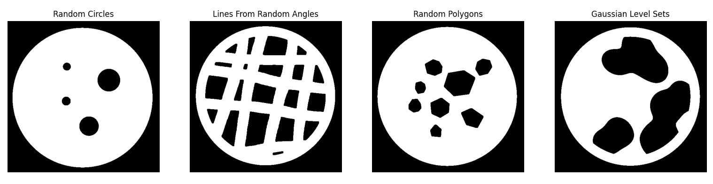

### Dealing with Different Angular Subsets

For limited-angle tomography we are given a subset $[\varphi_\text{start}, \varphi_\text{end}] \subset [0, 2\pi]$ of the full angular interval. In general, we cannot assume that the starting angle $\varphi_\text{start}=0$ is zero during the evaluation period. However, we can use that a shift of the angles in the sinogram corresponds to rotating the phantom. So, we can first shift the angles to $[0, \varphi_\text{end} - \varphi_\text{start}]$, reconstruct the phantom using the 
LPD trained on this angular range, and rotate the reconstruction by $\varphi_\text{start}$ counter-clockwise. This relation holds for parallel-beam computed tomography. We use this as an approximation for the given fan-beam case.

## Examples

We plot a few example reconstructions for the provided challenge phantoms and our synthetic phantoms.

<div id="syntheticdata"/>

### Synthetic Data 

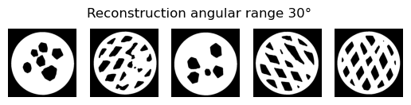

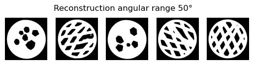
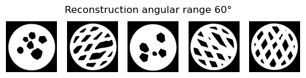
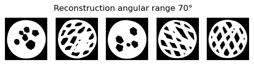

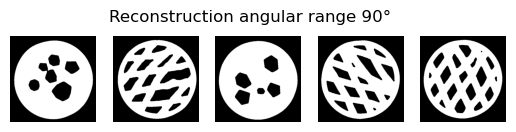
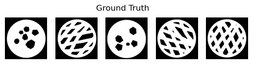


<div id="challengedata"/>

### Challenge Data 

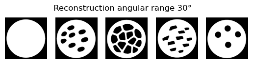
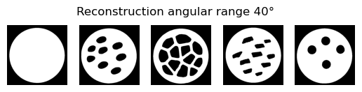

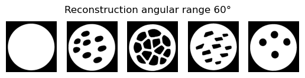


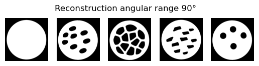
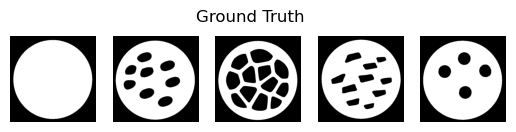


## Evaluation

We evaluate the LPD model w.r.t. the [score function](https://www.fips.fi/HTCrules.php#anchor1) used in the challenge.

### Synthetic Data (100 random phantoms)

| Angular Range | Score (mean $\pm$ std) |
|---------------|------------------------|
| 30            | $0.954 \pm 0.003$      |
| 40            | $0.955 \pm 0.024$      |
| 50            | $0.967 \pm 0.01 $      |
| 60            | $0.979 \pm 0.008$      |
| 70            | $0.954 \pm 0.034$      |
| 80            | $0.980 \pm 0.008$      |
| 90            | $0.978 \pm 0.015$      |


### Challenge Data

We evaluate the LPD model w.r.t. the [score function](https://www.fips.fi/HTCrules.php#anchor1) used in the challenge. We test two different scenarios. In the first column we evalute the model on a fixed angular range $[0, \varphi]$. In the second column we use random subsets $[\varphi_1, \varphi_2]$ and take the mean over 50 random subsets.


| Angular Range | Score (fixed angles) | Score (random angles) |
|---------------|----------------------|-----------------------|
| 30            |   $0.990 \pm 0.005$  | $0.989 \pm 0.006$     |
| 40            |   $0.988 \pm 0.006$  | $0.988 \pm 0.007$     |
| 50            |   $0.990 \pm 0.006$  | $0.989 \pm 0.005$     |
| 60            |   $0.991 \pm 0.005$  | $0.991 \pm 0.004$     |
| 70            |   $0.989 \pm 0.006$  | $0.989 \pm 0.005$     |
| 80            |   $0.993 \pm 0.004$  | $0.992 \pm 0.004$     |
| 90            |   $0.994 \pm 0.003$  | $0.992 \pm 0.004$     |

## Authors

Team University of Bremen, Center of Industrial Mathematics (ZeTeM): 

- Alexander Denker, Clemens Arndt, Judith Nickel, Johannes Leuschner, Janek Gödeke, Sören Dittmer