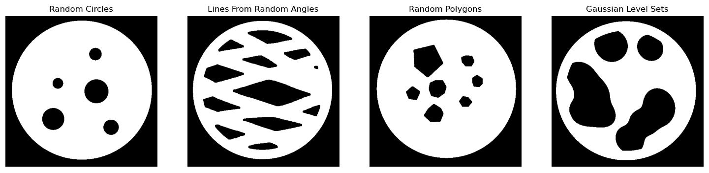

# Submission to the Helsinki Tomography Challenge 2022

## Method

We tested a modified [learned primal-dual](https://arxiv.org/abs/1707.06474) (LPD) model trained only on synthetic training data. The learned primal-dual model is a type of learned iterative method which integrates the forward operator and its adjoint directly into the network architecture. Additionaly it mimics the traditional primal-dual algorithm but uses neural network components instead of the proximal mappings. Empirical studies have also shown that models of this type are more data efficient (see for example [Baguer et. al. (2020)](https://iopscience.iop.org/article/10.1088/1361-6420/aba415)). 

However, the learned primal-dual architecture is not specialized to limited-angle tomography. We are aware that there exist deep learning methods that are more adapted to limited-angle CT, for example the work by [Bubba et. al. (2018)](https://arxiv.org/abs/1811.04602). Nonetheless, we wanted to give it a shot. 

Important for our approach is the generation of synthetic training phantoms. Especially for limited-angle CT some parts, i.e. edges with specific orientations, cannot be reconstructed. So our deep learning approach has to predict these missing image parts. In order for this inpainting to work reliably, the training data should match the challenge data. We used four different methods to create synthetic phantoms and used our numerical forward operator to simulate limited-angle measurements. The LPD is then trained end-to-end using the simulated measurements and the synthetic phantoms.

### Forward Operator 

The exact forward operator was not specified in the challenge. Therefore we used the information provided by the challenge organizer and the metadata of the matlab files to build an approximate forward operator using [ODL](https://odlgroup.github.io/odl/). 

### Modifications to LPD

A by now common modification to learned primal-dual is to exchange the adjoint with a filtered version, here we use the filtered backprojection. We the standard values in ODL (Ram-Lak filter and no frequency cut-off) and did not test alternatives. As we trained the network end-to-end the network is quite memory hungry, so we could only use a batch size of 6. Because of the small batch size, we switched from batch normalization to group normalization. In addition, we exchanged the lightweight CNN in the primal update with a UNet. At the end of the LPD we added a larger UNet.

Furthermore, we trained the LPD with a cross entropy loss instead of the often used L2 loss function. As we are only interested in the final segmentation, and the specific intensity values are of no interest, we normalize all sinograms to have unit norm. Using this normalization our model should be invariant to changes in the intensity of the phantom. 

### Synthetic Training Data

We implemted four different methods to generate new phantoms: 
- Disk with non-overlapping circular holes 
- Disk with non-overlappling polygonal holes
- Disk with holes using two sets of lines with different angles
- Disk with holes using the level-set of sums of gaussians

The phantoms were created on the fly during training. The center point of the disk was choosen randomly near the center of the image. 

The challenge data was only used for validation of the model. Currently we are training using 250.000 (250 epochs with 1000 examples each) synthetic phantoms. 

### Dealing with Different Angular Subsets

For limited-angle tomography we are given a subset $[\varphi_\text{start}, \varphi_\text{end}] \subset [0, 2\pi]$ of the full angular interval. In general, we cannot assume that the starting angle $\varphi_\text{start}=0$ is zero during the evaluation period. However, we can use that a shift of the angles in the sinogram corresponds to rotating the phantom. So, we can first shift the angles to $[0, \varphi_\text{end} - \varphi_\text{start}]$, reconstruct the phantom using the 
LPD trained on this angular range, and rotate the reconstruction by $\varphi_\text{start}$ counter-clockwise. This relation holds for parallel-beam computed tomography. We use this as an approximation for the given fan-beam case.

## Examples

We plot a few example reconstructions for the provided challenge phantoms and our synthetic phantoms.

### Challenge Data 

### Synthetic Data

## Authors

Team University of Bremen, Center of Industrial Mathematics (ZeTeM): 

- Alexander Denker, Clemens Arndt, Judith Nickel, Johannes Leuschner, Sören Dittmer